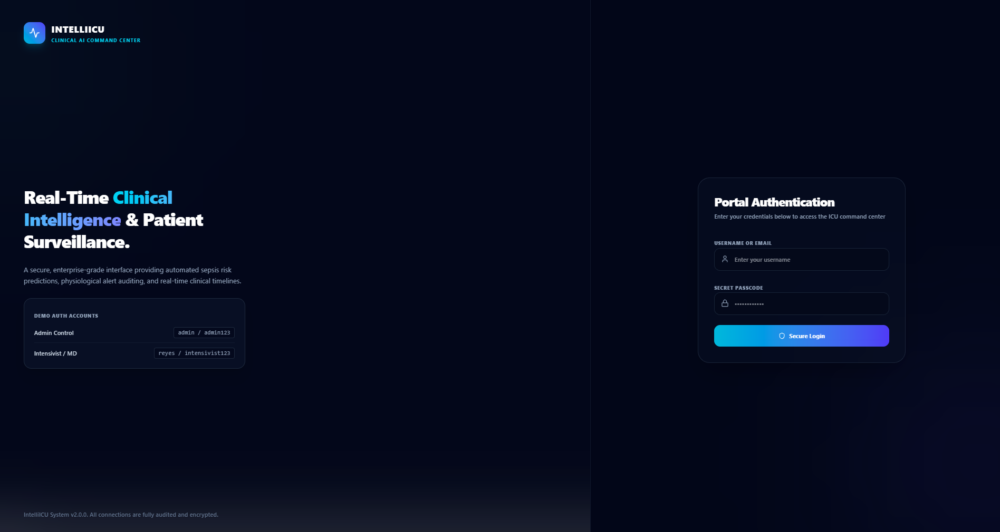
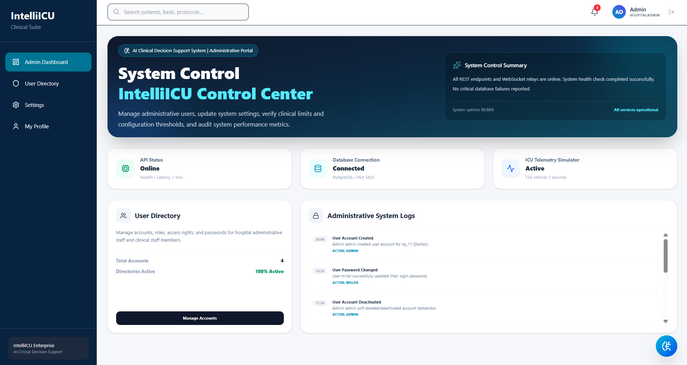
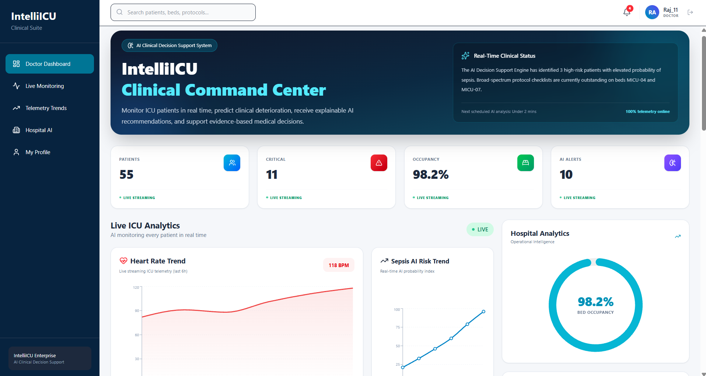
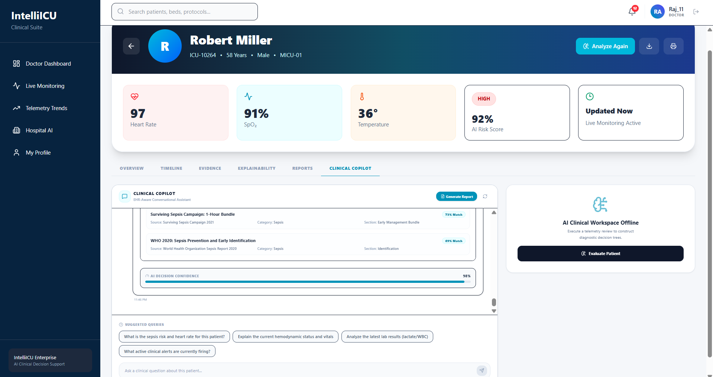
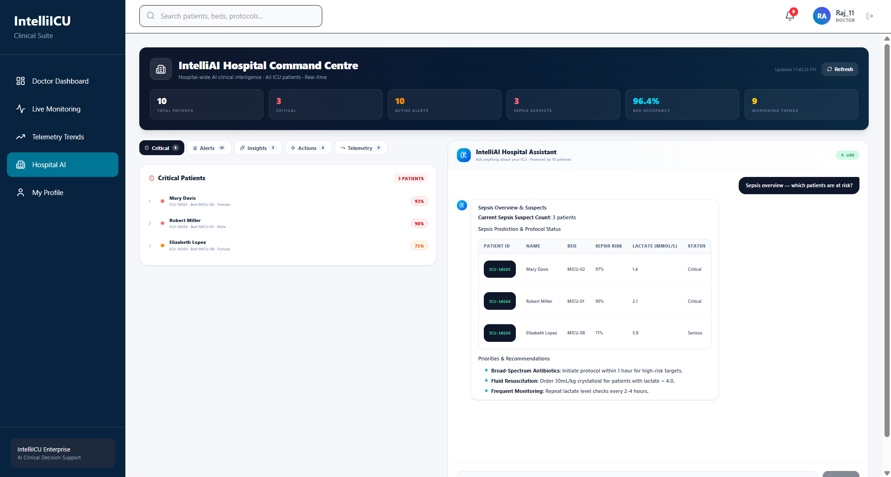
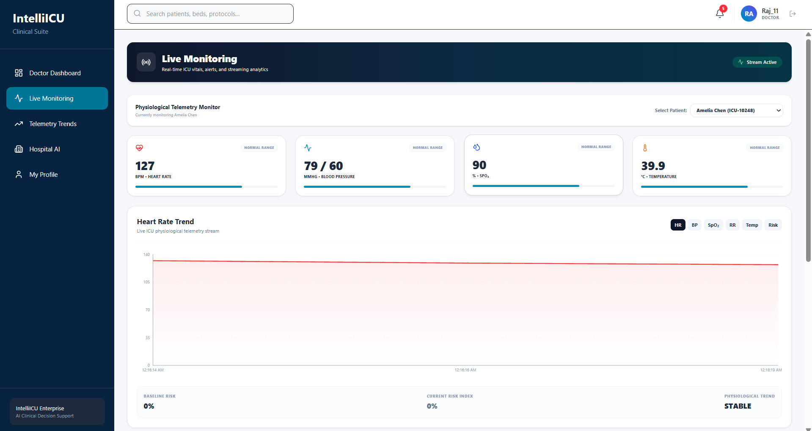
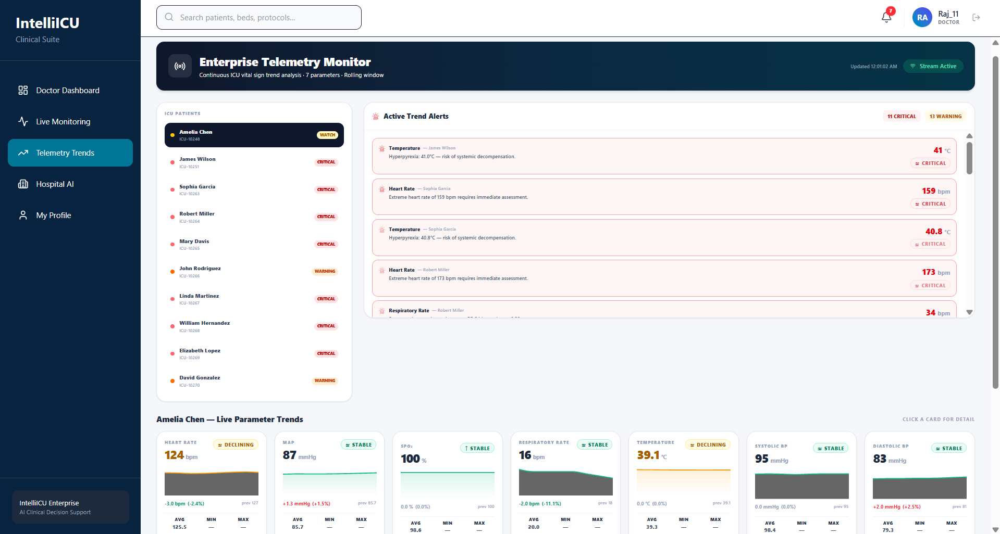
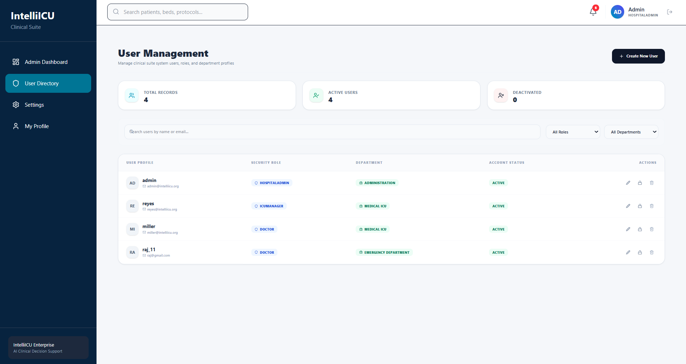

# 🏥 IntelliICU — Enterprise AI Clinical Decision Support Platform

> **AI-Powered Clinical Decision Support, ICU Monitoring, Clinical Copilot, and Hospital Intelligence Platform**

[](https://python.org)
[](https://fastapi.tiangolo.com)
[](https://reactjs.org)
[](https://postgresql.org)
[](https://docker.com)
[](LICENSE)
[](#)
[](#)

---

## 📌 What is IntelliICU?

IntelliICU is an enterprise-grade AI Clinical Decision Support System (CDSS) that **supports clinicians with intelligent patient monitoring, real-time telemetry, AI-assisted clinical decisions, and hospital management — all in one unified platform.**

Right now in every hospital, clinical teams face:
- Alert fatigue from hundreds of monitoring signals
- Manual correlation of patient vitals across disconnected systems
- Time-consuming incident documentation
- No AI layer to interpret clinical patterns or suggest next steps

**IntelliICU brings an AI copilot directly into the clinical workflow — giving doctors context-aware support without replacing their judgment.**

> **Medical Disclaimer:** IntelliICU is built for educational, research, and portfolio purposes. It is not a certified medical device and is not intended to replace professional clinical judgment.

---

## 🏗️ Architecture

```
                        ┌─────────────────────┐
                        │        Users        │
                        │  Admins / Doctors   │
                        └──────────┬──────────┘
                                   │
                                   ▼
                        ┌─────────────────────┐
                        │   React Frontend    │
                        │  Dashboards & UI    │
                        │  Nginx Production   │
                        └──────────┬──────────┘
                                   │
                              HTTPS REST API
                              Secure WebSocket
                                   │
                                   ▼
                     ┌───────────────────────────┐
                     │      FastAPI Backend      │
                     └─────────────┬─────────────┘
                                   │
             ┌─────────────────────┼─────────────────────┐
             │                     │                     │
             ▼                     ▼                     ▼
    ┌────────────────┐    ┌────────────────┐    ┌────────────────┐
    │ Authentication │    │  Clinical / AI │    │ Hospital APIs  │
    │   & RBAC       │    │   Services     │    │ & Management   │
    └───────┬────────┘    └───────┬────────┘    └───────┬────────┘
            │                     │                     │
            └─────────────────────┼─────────────────────┘
                                  │
                                  ▼
                       ┌─────────────────────┐
                       │   PostgreSQL DB     │
                       │   SQLAlchemy ORM    │
                       └─────────────────────┘
```

---

## ✨ Features

### 🔐 Authentication & Security
- JWT-based secure authentication
- Password hashing (bcrypt)
- Role-Based Access Control (RBAC) — Admin and Doctor roles
- Protected API endpoints with token validation
- CORS configuration for secure cross-origin requests

### 👨‍⚕️ Doctor Dashboard
- Clinical overview and patient information
- ICU monitoring access
- AI-powered clinical tools
- Real-time patient data
- Hospital workflow integration

### 🛡️ Admin Dashboard
- Platform overview and system statistics
- User management and role assignment
- Hospital management controls
- Operational monitoring
- Administrative actions

### 🤖 AI Clinical Copilot
- AI-assisted clinical decision support
- Patient context analysis
- Risk interpretation and clinical recommendations
- Medical knowledge assistance
- Context-aware interactions powered by LLM
- Decision-support tool — does not replace professional judgment

### 🏥 Hospital Assistant
- AI-powered hospital operations support
- Clinical workflow assistance
- Healthcare-related query handling
- Context-aware responses

### 📡 Live ICU Monitoring
- Real-time patient and ICU visualization
- Vital sign tracking with live updates
- Clinical alert system
- ICU patient overview dashboard

### 📊 Telemetry Monitoring
- Continuous patient physiological data visualization
- Heart rate, blood pressure, oxygen saturation, respiratory rate, temperature
- Real-time telemetry streams via WebSocket
- Clinical signal visualization interface

### 👥 User Management
- View and manage platform users
- Role assignment and access control
- User status management
- Administrative user actions

---

## 🛠️ Tech Stack

| Component | Technology | Purpose |
|-----------|-----------|---------|
| Frontend | React + Vite | Modern component-based UI |
| UI Server | Nginx | Production static file serving |
| Backend | FastAPI + Python | REST API + WebSocket server |
| Database | PostgreSQL | Persistent relational storage |
| ORM | SQLAlchemy | Database abstraction layer |
| Auth | JWT + bcrypt | Secure authentication |
| AI/ML | scikit-learn, Pandas, NumPy | ML model integration |
| RAG | LlamaIndex / LangChain | Clinical knowledge retrieval |
| LLM | OpenAI / Gemini / Ollama | Clinical copilot inference |
| Real-time | WebSockets | Live telemetry and monitoring |
| Deploy | Railway | Cloud hosting (frontend + backend) |
| CI/CD | GitHub Actions | Automated build validation |
| Containers | Docker + Docker Compose | Containerized deployment |

---

## 🌐 Live Demo

| Service | URL |
|---------|-----|
| Live Application | [Open IntelliICU](#) |
| Backend API | [IntelliICU Backend](#) |
| API Docs (Swagger) | [FastAPI Swagger Docs](#) |
| GitHub | [github.com/nite208/IntelliICU](https://github.com/nite208/IntelliICU) |

---

## 🚀 Quick Start

### Prerequisites
- Python 3.10+
- Node.js 20+
- npm
- Git
- Docker (optional)
- PostgreSQL (if running locally)

### 1. Clone the repo
```bash
git clone https://github.com/nite208/IntelliICU.git
cd IntelliICU
```

### 2. Configure environment
```bash
cp .env.example .env
# Fill in your values
```

Key environment variables:
```env
# Database
POSTGRES_URL=your_postgres_connection_string

# Auth
JWT_SECRET=your_jwt_secret

# LLM Provider (choose one)
OPENAI_API_KEY=your_openai_key
GEMINI_API_KEY=your_gemini_key
# OR for local: OLLAMA_BASE_URL=http://localhost:11434
```

### 3. Start the backend
```bash
cd backend
python -m venv .venv

# Windows
.venv\Scripts\Activate.ps1

# Mac/Linux
source .venv/bin/activate

pip install -r requirements.txt
uvicorn app.main:app --reload
```

Backend runs at `http://localhost:8000`
Swagger docs at `http://localhost:8000/docs`

### 4. Start the frontend
```bash
cd frontend
npm install
npm run dev
```

Frontend runs at `http://localhost:5173`

### 5. Docker (alternative — runs everything at once)
```bash
docker compose up --build
```

---

## 📡 API Endpoints

### Authentication
```
POST /auth/login        — JWT login
POST /auth/register     — Create new user
POST /auth/refresh      — Refresh token
```

### Clinical
```
GET  /api/patients      — List ICU patients
GET  /api/patients/{id} — Patient detail + vitals
GET  /api/monitoring    — Live monitoring feed
POST /api/copilot/chat  — Clinical copilot interaction
```

### Admin
```
GET  /api/users         — List users (admin only)
POST /api/users         — Create user (admin only)
PUT  /api/users/{id}    — Update user role
GET  /api/hospital      — Hospital management data
```

---

## 🖼️ Screenshots

### 🔐 Login


### 🛡️ Admin Dashboard


### 👨‍⚕️ Doctor Dashboard


### 🤖 Clinical Copilot


### 🏥 Hospital Assistant


### 📡 Live Monitoring


### 📈 Telemetry Monitor


### 👥 User Management


---

## 📁 Project Structure

```
IntelliICU/
│
├── .github/
│   ├── ISSUE_TEMPLATE/
│   ├── workflows/          ← GitHub Actions CI/CD
│   └── pull_request_template.md
│
├── backend/                ← FastAPI Python backend
│   ├── app/
│   │   ├── main.py         ← Entry point
│   │   ├── auth/           ← JWT authentication
│   │   ├── clinical/       ← Clinical APIs
│   │   ├── admin/          ← Admin APIs
│   │   ├── models/         ← SQLAlchemy models
│   │   └── schemas/        ← Pydantic schemas
│   └── requirements.txt
│
├── frontend/               ← React + Vite frontend
│   ├── src/
│   │   ├── pages/          ← Page components
│   │   ├── components/     ← Reusable UI components
│   │   └── lib/            ← API client, utilities
│   └── package.json
│
├── docker/                 ← Docker config files
├── screenshots/            ← Application screenshots
├── tests/                  ← Automated tests
├── .env.example
├── docker-compose.yml
├── CONTRIBUTING.md
└── README.md
```

---

## 🧩 Core Platform Modules

| Module | Description |
|--------|-------------|
| 🔐 Authentication | Secure JWT-based auth with RBAC |
| 👨‍⚕️ Doctor Dashboard | Clinical interface for healthcare professionals |
| 🛡️ Admin Dashboard | Administrative platform management |
| 🤖 Clinical Copilot | AI-assisted clinical decision support |
| 🏥 Hospital Assistant | AI-powered hospital operations |
| 📡 Live Monitoring | Real-time ICU patient monitoring |
| 📈 Telemetry Monitor | Physiological telemetry visualization |
| 👥 User Management | User and role administration |
| 🔌 REST API | Frontend-backend communication |
| ⚡ WebSockets | Real-time telemetry streams |
| 🗄️ PostgreSQL | Persistent clinical data storage |

---

## 🔄 CI/CD Pipeline

GitHub Actions validates every push:
- ✅ Backend dependency installation
- ✅ Python application compile check
- ✅ Frontend dependency installation  
- ✅ Vite production build validation

```bash
# Manual test run
pytest

# Frontend build check
cd frontend && npm run build
```

---

## 🔮 Roadmap

### v1.1 — Clinical AI Enhancements
- [ ] Sepsis risk prediction model
- [ ] Cardiac risk early warning system
- [ ] Clinical deterioration scoring
- [ ] Explainable AI (XAI) for model predictions

### v1.2 — Platform Improvements
- [ ] Advanced patient telemetry streams
- [ ] Multi-hospital architecture
- [ ] Clinical audit logging
- [ ] Push notification and alert system

### v2.0 — Enterprise & Integrations
- [ ] FHIR / HL7 integration
- [ ] EHR system connectors
- [ ] Medical imaging integration
- [ ] Wearable device data ingestion
- [ ] Kubernetes deployment
- [ ] AI model versioning and monitoring

---

## ⚠️ Medical Disclaimer

IntelliICU is built for **educational, research, demonstration, and portfolio purposes**.

- Not a certified medical device
- Not intended for direct clinical diagnosis
- Does not replace qualified healthcare professionals
- Should not be the sole basis for medical decisions

All AI-generated recommendations should be treated as **decision-support information only**. Clinical decisions must always be made by qualified professionals using appropriate judgment.

---

## 🤝 Contributing

Contributions and suggestions welcome. See `CONTRIBUTING.md` for guidelines.

```bash
git checkout -b feature/your-feature-name
git add .
git commit -m "feat: add your feature"
git push origin feature/your-feature-name
# Then open a Pull Request
```

---

## 🔒 Security

- Never commit `.env` files or production credentials
- Never expose database passwords or JWT secrets
- Always validate incoming data
- Apply principle of least privilege
- For production healthcare use — additional regulatory, compliance, and clinical governance requirements apply

---

## 📄 License

MIT License — see `LICENSE` file for details.

---

## 👨‍💻 Developer

**Nitesh Kumawat**
- 🎓 Computer Engineering (Honours in Data Science), ISBM College of Engineering, Pune — 2026
- 🏆 Oracle Certified Generative AI Professional
- 🌐 Google Student Ambassador — AI/Gemini
- 💼 [LinkedIn](https://linkedin.com/in/nitesh-kumawat-185356289)
- 🐙 [GitHub](https://github.com/nite208)
- 📧 niteshkumawat2331@gmail.com

---

> ⭐ If IntelliICU is useful or interesting to you, give it a star — it helps others discover the project and supports continued development.

---

<p align="center">
  <strong>IntelliICU — Building the future of AI-powered Clinical Decision Support</strong>
</p>
